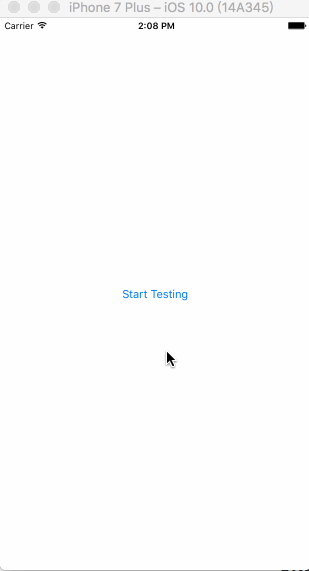

# JXDrawingCircleProgress
JXDrawingCircleProgress is an open-source 'UIButton' subclass built to make a circle styled count down animation with button. The most use case is to add a skip button to the Ad shows.



# Installation

### Manually

1. Download the project and drop `JXDrawingCircleProgress` folder into your project;
2. Import file `JXDrawingCircleProgressButton.h`.

# How to use it

```objective-c
- (void)viewDidLoad
{
    [super viewDidLoad];
    
    self.progressButton = [[JXDrawingCircleProgressButton alloc] initWithFrame:buttonFrame];
    _progressButton.lineWidth = 2.f;
    [_progressButton setTitle:@"Skip" forState:UIControlStateNormal];
    _progressButton.titleLabel.font = [UIFont systemFontOfSize:14.f];
    [_progressButton setTitleColor:[UIColor whiteColor] forState:UIControlStateNormal];
    [_progressButton addTarget:self action:@selector(__skipButtonTouched:) forControlEvents:UIControlEventTouchUpInside];
    
    [self.view addSubview:_progressButton];
}

- (void)someMethod
{
    [_progressButton startProgressAnimationWithDuration:5.f completionHandler:^(JXDrawingCircleProgressButton *progressButton) {
        NSLog(@"The circle progress button finished animation");
    }];
}
```
## Author
**Amos King** *email: wangjiuxing2010@hotmail.com*

##License
JXDrawingCircleProgress is released under MIT license. See LICENSE for details.

